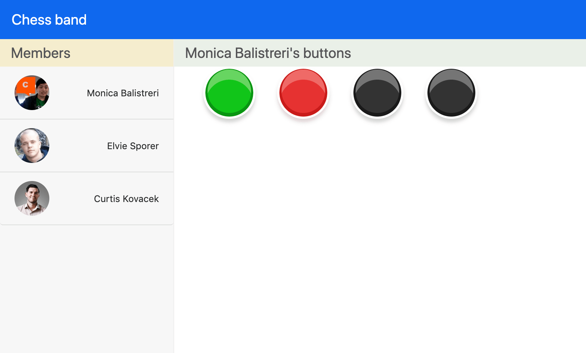

# chess-band

**Chess-band** is a backend service of a wearable band. It is based on Node.js and with the support of the Webscocket protocol  and Redis database. 

The frontend part is only for visualizing the overall data flow and concepts.

## Background

My friend Victor and I want to design a  wearable band that can send anonymous signals to a set of randomly assigned partners. You do not where does a message comes from, but it is there. Therefore, we need a backend service and that is why I come out with this repo. To be honest, the final result is not as good as we expect before. But it is indeed a good practice to learn something about Websocket and Redis.

## Preview


## Installation

To begin with this demo, please clone the repo.

- Clone the repo:`git clone https://github.com/Huoleit/chess-band.git` 

## Usage
```
npm install
```
> After the installation, please copy `.env.example` file to a new file named `.env`. You can configure service port and Redis address in `.env` file. The default port is `8008`.

## Reference
- AWS-sample **elasticache-refarch-chatapp** [](https://github.com/aws-samples/elasticache-refarch-chatapp)

